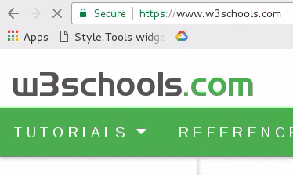
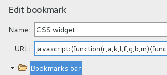

The [Style.Tools](https://style.tools/) project started as a free browser-widget that provides a sort of DevTools (developer tools) for frontend optimization (FEO).

Style.Tools is available with 1 click **on any page on the internet**, including pages behind a login.



Style.Tools provides access to advanced technologies for CSS optimization including:

- CSS editor with themes
- Critical CSS generator
- Unused CSS extractor and remover
- Duplicate CSS extractor and remover (unique innovation)
- CSS beautify
- CSS code optimization ([clean-css](https://github.com/jakubpawlowicz/clean-css))
- CSS code repair (fix malformed CSS)
- CSS lint (quality checks)
- CSS statistics (analysis)
- [PostCSS](https://github.com/postcss/postcss) plugins: autoprefixer and many more
- Above-the-fold optimizer

The widget provides **localhost and offline support** via a Service Worker on domain [style.tools](https://style.tools/). You can use many of the features locally without an internet connection. The cache for preferences is also preserved across domains which makes it efficient when working on multiple websites.

# Installation

The widget is a small piece of Javascript code that can be added to the browser bookmarks bar via the URL prefix `javascript:`.

```javascript
javascript:(function(r,a,k,l,f,g,b,m){function n(c,b,d){a.open();b&&(r.onmessage=b);d&&a.addEventListener("securitypolicyviolation",d);a.write(c);a.close()}f="https://style.tools/";g="Style.Tools";var c=a.createElement("script");c.src=f+"x.js";c.onerror=function(){function p(d){if(c=d?d.violatedDirective:0){if("script-src"==c||m)return;m=1;b&&l(b)}if(!q){var h=f+"#"+a.location;a.getElementById("e").innerHTML='<h2 style="color:red;">'+g+(c?' blocked by CSP <font color="blue">'+c+"</font>":" failed to load")+
'.</h2><h3>Redirecting <a href="'+h+'">'+h+"</a>...</h3>";b=k(function(){a.location.href=h},3E3)}}var q;n("<h2>Loading "+g+" via Service Worker...</h2><iframe src="+f+'go height=50></iframe><p id="e"></p>',function(a){q=1;b&&l(b);n("<script>"+a.data+"\x3c/script>")},p);b=k(p,2E3)};a.head.appendChild(c)})(window,document,setTimeout,clearTimeout);
```

Source: https://github.com/style-tools/widget/blob/master/widget.js (849 Bytes)

The code can be used from the browser console or simply initiated using a custom function on a website.

## Creating a bookmark

You can use the bookmark functionality of your browser to create a new bookmark. The short cut in Google Chrome and Firefox is `Ctrl-D`.



Once the bookmark is added, you can drag it to the bookmarks bar for quick access.


### Drag & drop to bookmarks bar

🔬 Style.Tools provides a drag & drop link via the logo (top left). It will automatically create the correct widget link in the bookmarks.


